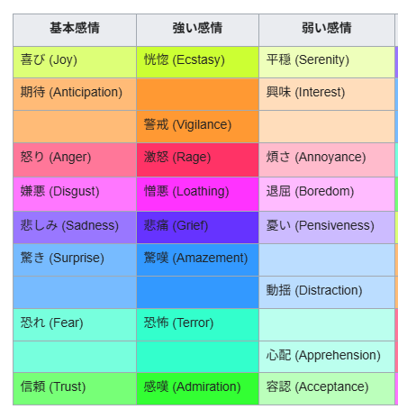

# MVP 要件定義書（音声通話×表情推定カウンセリング）

## 1. 目的と背景
- Webアプリとして、音声通話でカウンセリング体験を提供する。
- カメラ映像を使って表情を推定し、会話の補助に活用する。
- 表情推定は「確定診断」ではなく、会話支援のための補助情報として扱う。

## 2. MVPのスコープ
### 2.1 含める機能
- 同意取得（カメラ/マイク/表情推定の利用）
- 相談カテゴリ選択
- 音声通話（WebRTC）
- 表情推定（クライアント側）と感情ラベル送信
- 会話生成（LLM）
- 終了時の会話サマリ

### 2.2 含めない機能
- 画像や動画のサーバー保存
- 長期的な履歴管理や分析ダッシュボード
- 医療的診断や治療を目的とした機能
- 多言語対応
- 有料課金/アカウント管理

## 3. 主要ステークホルダー
- 利用者（相談者）
- 運営者（アプリ管理者）

## 4. ユーザーシナリオ
1. ユーザーが同意画面でカメラ・マイク利用と表情推定に同意する。
2. 相談カテゴリを選ぶ。
3. 通話準備画面でマイク・カメラの動作を確認する。
4. 通話を開始し、会話が進む。
5. 表情推定の結果が会話トーンの補助に使われる。
6. 通話終了後、簡易サマリを受け取る。

## 5. 機能要件
### 5.1 画面・UX
- 同意画面
- 相談カテゴリ選択画面
- 通話準備画面（カメラ/マイクチェック、表情推定のON/OFF）
- 通話画面（音声通話UI、控えめな状態表示）
- 終了画面（サマリ表示）

### 5.2 感情推定
- 表情推定はクライアント側で実行する。
- 推定結果は「基本感情8種」をラベルとして扱う。
  - joy / anticipation / anger / disgust / sadness / surprise / fear / trust

- 強弱は `intensity (0.0〜1.0)` で表現する。
- 推定間隔は 200〜300ms 目安とし、UIはブレを抑える。

### 5.3 会話生成
- LLMが会話を生成する。
- 直近の感情ウィンドウ（label/intensity/confidence）を入力に含める。
- 断定的表現を避け、「〜のように見えます」等の表現を使う。

### 5.4 会話サマリ
- セッション終了時に短い箇条書きサマリを返す。
- 医療的判断は行わない。

## 6. 非機能要件
### 6.1 パフォーマンス
- 音声通話は遅延が体感できないレベルを目指す。
- 感情推定はリアルタイム性を優先し、軽量処理とする。

### 6.2 セキュリティ/プライバシー
- 画像データはサーバーに送信しない。
- 保存するのはセッション情報とサマリのみ（必要最小限）。
- 同意取得を明示し、撤回の導線を用意する。

### 6.3 可用性
- MVPでは高可用性要件は限定的とする。

## 7. 画面遷移
- 同意 → カテゴリ選択 → 通話準備 → 通話 → 終了

## 8. API要件（MVP）
### 8.1 セッション作成
- `POST /api/session`
- 入力: category, consent
- 出力: session_id, ws_url, webrtc_ice

### 8.2 WebSocket（シグナリング/感情イベント）
- webrtc_offer / webrtc_answer / webrtc_ice_candidate
- emotion_update（label / confidence / intensity / delta）

### 8.3 会話生成
- `POST /api/chat`
- 入力: user_text, emotion_window
- 出力: assistant_text

### 8.4 セッション終了
- `POST /api/session/end`
- 出力: summary

## 9. 制約・前提
- ブラウザでのカメラ・マイク許可が必須。
- 医療行為ではなく、会話補助の範囲に限定する。
- 表情推定は不確実であることを明示する。

## 10. 成功条件（MVP）
- 音声通話が安定して成立する。
- 感情ラベルがリアルタイムに送信される。
- 会話が感情変化に応じて調整される。
- 通話終了時にサマリが表示される。
